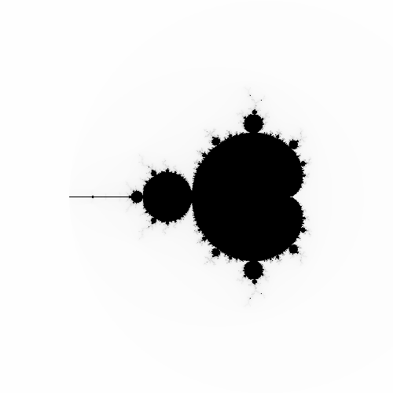
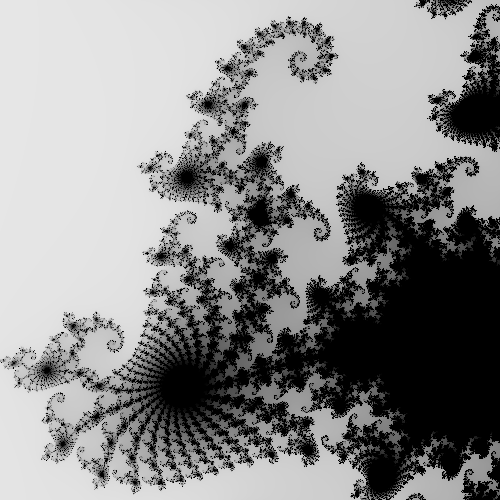

# Mandelbrot Set Generator

This project contains a multithreaded program for generating and visualizing the Mandelbrot set, written in C.

## File Structure

- `mandelbrot.c`: This is the main source file for the Mandelbrot set generator.
- `mandeloutput.bmp`: This is the output file for viewing the Mandelbrot.

## Building

To build the project, run the following command:

```bash
gcc -pthread -Wall -Wextra -Wpedantic -o mandelbrot mandelbrot.c
```

## Running The Program

To run the program use the following syntax:

```bash
./mandelbrot [image_dimensions] [engines] [complex_x] [complex_y] [mandelbrot_dimension]
```

## Definitions

- `image_dimensions`: The height and width of the image in pixels.
- `engines`: The number of engine threads used to process the Mandelbrot set.
- `complex_x & complex_y`: The floating point values for the coordinates of the top left of the image.
- `mandelbrot_dimension`: The height and width of the image in the complex plane.

## Samples

Some samples would be:

- The overview:

```bash
./mandelbrot 500 10 -2.7 -2.0 4.0
```



- Zoomed in:

```bash
./mandelbrot 500 10 -0.749602903 -0.132456468 0.010477299
```


